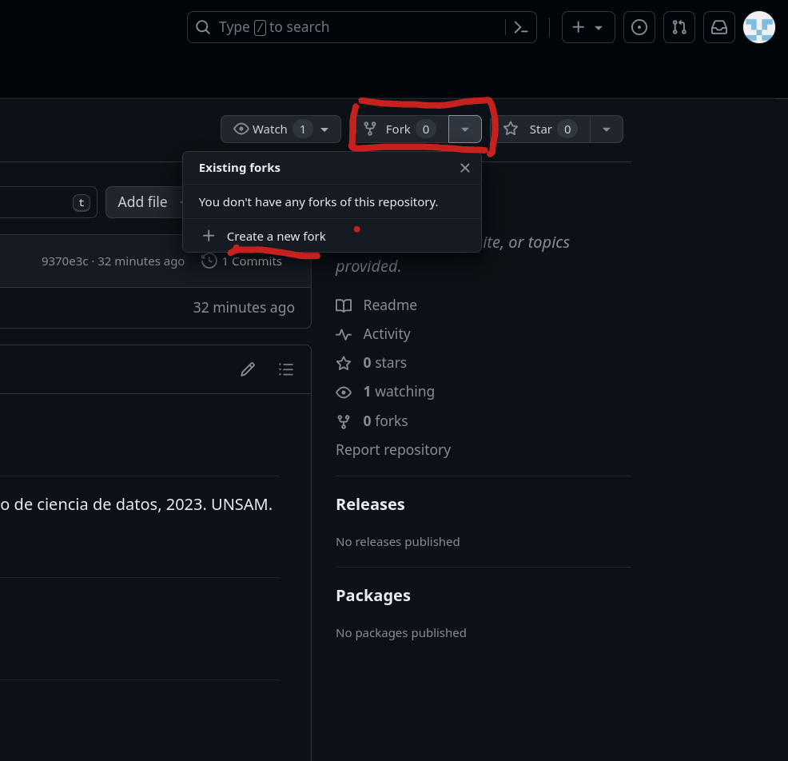
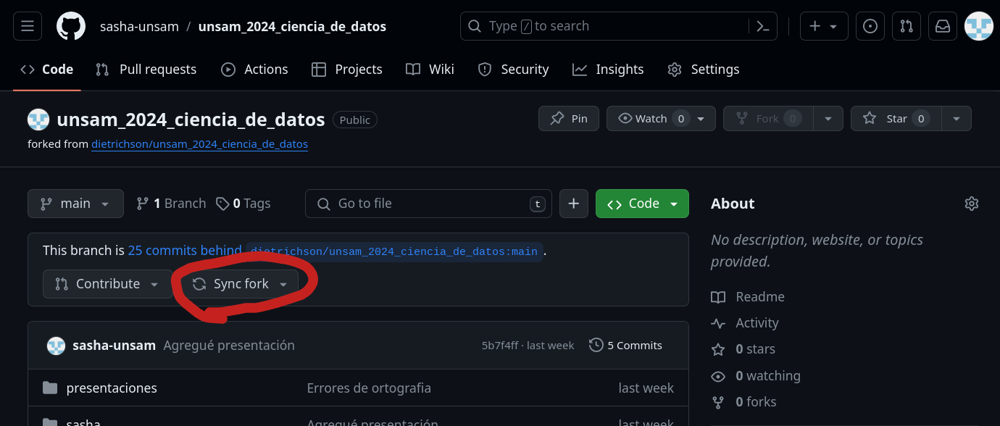
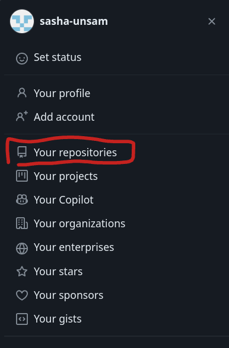
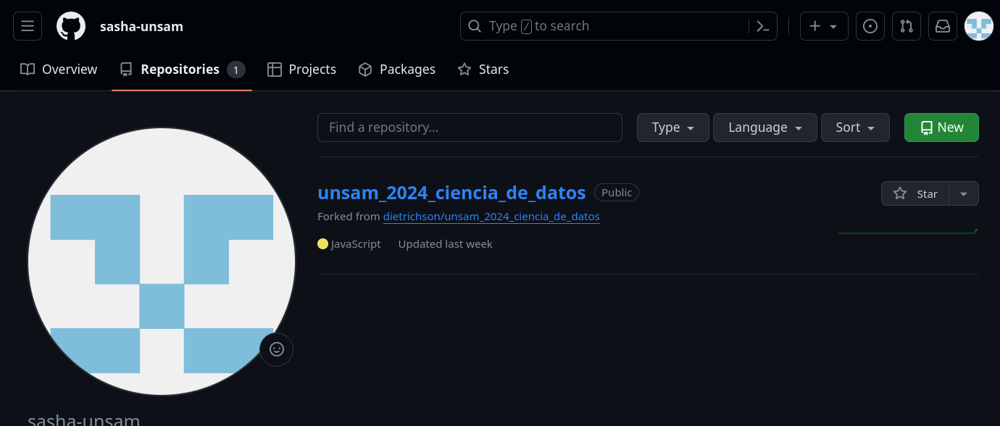
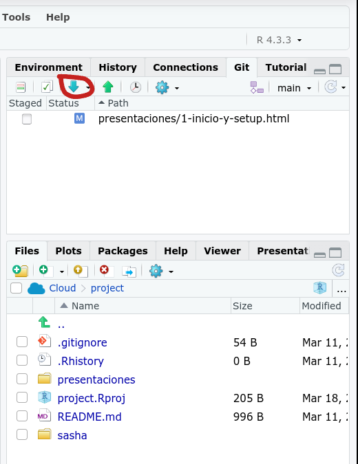

## ¿Qué es GitHub?

- Es un sistema de repositorios para guardar y compartir código

- Ahí vive el repositorio del seminario

## Abrir una cuenta

- Navegá a <https://github.com/>

- Abrí una cuenta gratuita

## Fork del repositorio

- Sirve para conectar los dos repositorios

- Genera una copia del repositorio en tu propio GitHub

- Permite sincronizar y generar «pull requests»

- Navegá a <https://github.com/dietrichson/IA-UNSAM-2026>

## Fork

## Pull request

1. Hacé tus cambios en tu fork (tu carpeta con tu nombre)

2. Hacé «commit» y «push»

3. En GitHub entrá a tu fork

4. Hacé click en el botón «Contribute»

5. Elegí «Open pull request»

6. Revisá los cambios y hacé click en «Create pull request»

## Pull request — ¿dónde?

El botón «Contribute» está al lado de «Sync fork»

## Sincronizar tu fork

1. Ir a tu repositorio (no el del profesor)

2. Entrar al repo

3. Click en «Sync fork»

4. En RStudio hacer «pull»

## Sincronizar - 1

## Sincronizar - 2

## Sincronizar - 3

## Sincronizar - 4

## Resumen

- «Fork»: una sola vez

- «Pull request»: para entregar tu trabajo

- «Sync fork»: antes de empezar a trabajar
