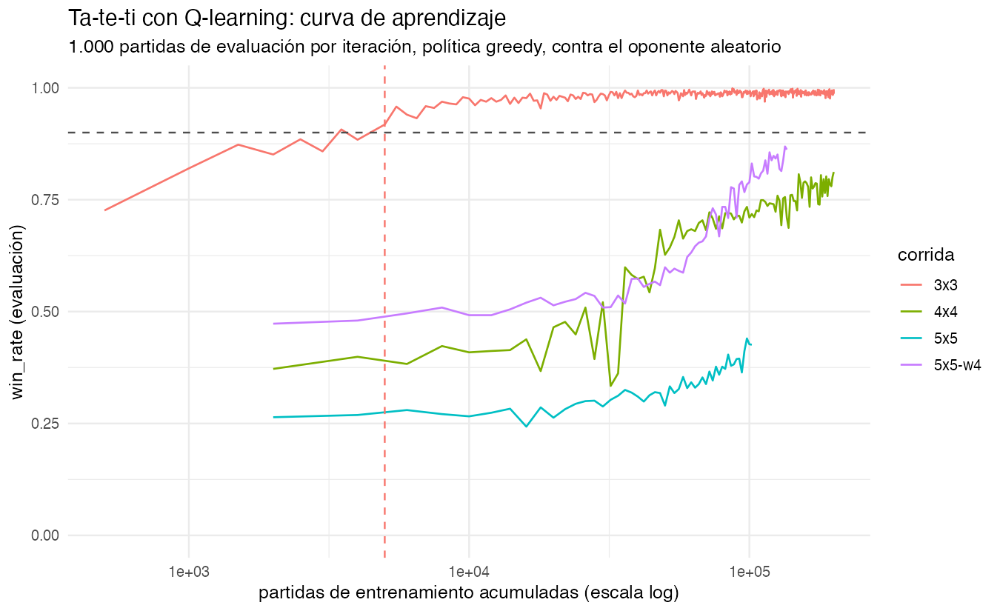
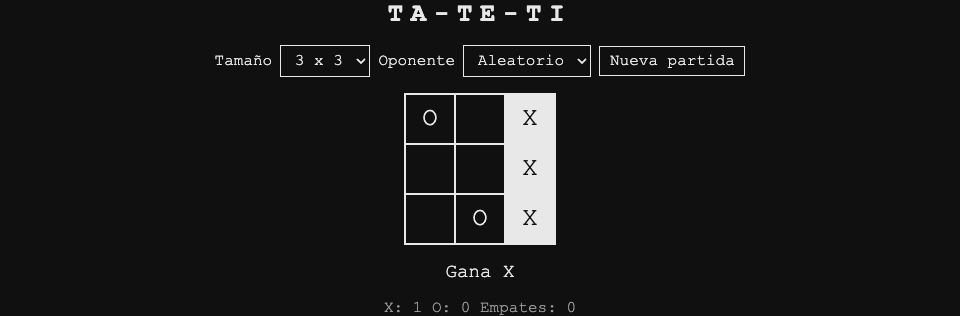
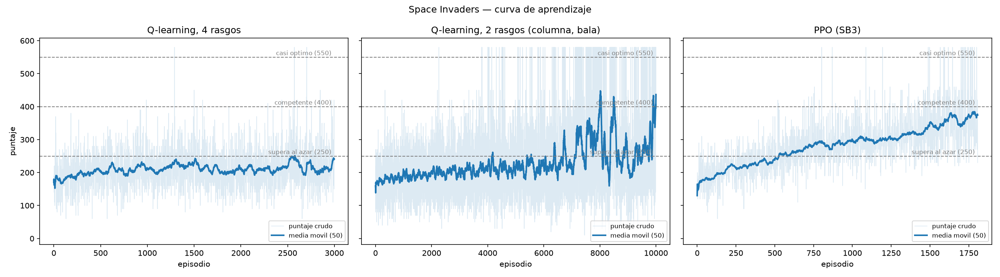
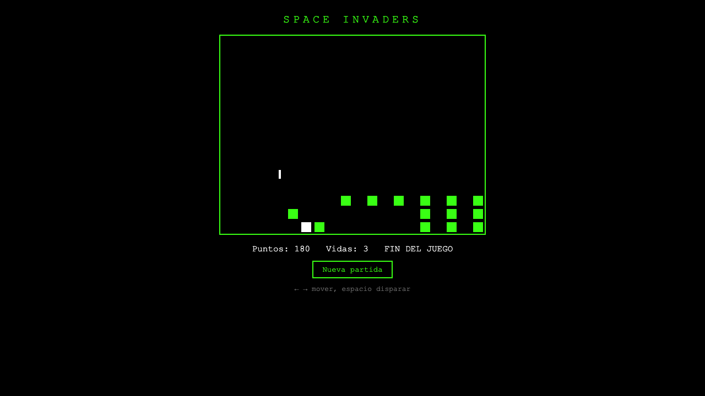
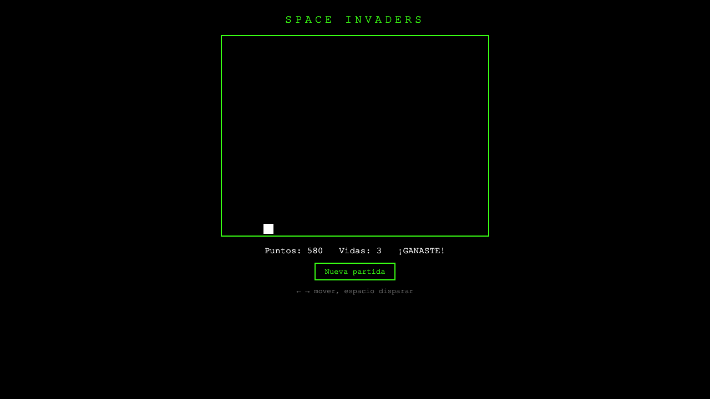

## Agenda de hoy

1.  Revisión de entregas (laboratorio 4, en vivo)

2.  Qué es *reinforcement learning*

3.  Ta-te-ti en R

4.  Space Invaders en Python

5.  Qué aprendimos

# 1. Revisión de entregas

## Revisión de entregas

-   Revisamos los PRs y los issues en vivo, en el repo.

-   Lo que miramos: ¿corre? ¿se entiende? ¿qué le pidieron al modelo?

# 2. Qué es reinforcement learning

## Cinco palabras y nada más

-   **Agente**: el que decide. Acá, unas 60 líneas de código.

-   **Entorno**: el juego. No se toca, no se explica, no se modifica.

-   **Estado**: lo que el agente ve en este instante.

-   **Acción**: lo que el agente puede hacer.

-   **Recompensa**: un número, después de cada acción.

-   **Episodio**: una partida, de principio a fin.

::: {.fragment}
Nadie le explica las reglas al agente. Sólo recibe números, premios y castigos.
:::

## El loop

```{mermaid}
%%| fig-width: 8
%%{init: {"htmlLabels": false, "flowchart": {"htmlLabels": false}}}%%
flowchart LR
    A[Agente] -->|acción| E[Entorno]
    E -->|estado, reward| A
```

-   `reset()` → estado inicial.

-   `step(acción)` → `(estado, recompensa, done)`.

-   Cuando `done` es verdadero, termina el episodio y se vuelve a `reset()`.

## El mismo loop, en los dos juegos {.smaller}

::: columns
::: {.column width="50%"}
**Ta-te-ti**, consola del navegador:

``` javascript
game.reset({ size: 3, opponent: 'random' })
game.getActions()   // celdas libres
game.step(4)        // → { state, reward, done }
```
:::

::: {.column width="50%"}
**Space Invaders**, consola del navegador:

``` javascript
game.reset({ seed: 1 })
game.getActions()   // siempre [0, 1, 2, 3]
game.step(3)        // → { state, reward, done }
```
:::
:::

::: {.fragment}
Es el mismo contrato: `reset`, `step`, `getState`, `getActions`. Se definió en la clase 7, antes de que existiera una línea de código de los juegos. Hoy se ve para qué servía.
:::

## Explorar o explotar

El agente arranca sin saber nada. Si siempre elige lo que ya le salió bien, nunca prueba nada nuevo.

**ε-greedy**: con probabilidad $\varepsilon$ juega al azar; si no, juega lo mejor que conoce.

-   $\varepsilon = 1{,}0$ al empezar: todo al azar.

-   $\varepsilon$ baja con el tiempo hasta 0,05 o 0,1.

-   En la **evaluación** se pone $\varepsilon = 0$: sólo la política aprendida.

::: {.fragment}
Los dos proyectos de hoy bajan epsilon en línea recta y evalúan siempre en modo *greedy*.
:::

## La tabla Q {.smaller}

Una tabla de consulta: para cada par (estado, acción), un número.

$$Q(\text{estado}, \text{acción}) = \text{qué tan bueno es hacer eso, ahí}$$

-   Jugar es leer la fila del estado actual y quedarse con el máximo.

-   Aprender es corregir los números de la tabla.

-   No hay red neuronal: la tabla se puede imprimir y leer.

::: {.fragment}
Hace falta una fila por estado. Toda la clase de hoy es qué pasa cuando los estados no entran.
:::

## La regla de actualización {.smaller}

$$Q(s,a) \leftarrow Q(s,a) + \alpha\,[\,r + \gamma \max_{a'} Q(s',a') - Q(s,a)\,]$$

| Símbolo | Qué es |
|---|---|
| $s$, $a$ | Dónde estaba y qué hizo. |
| $r$ | La recompensa que recibió. |
| $s'$ | Dónde fue a parar. |
| $\max_{a'} Q(s',a')$ | Lo mejor que se consigue desde ahí. |
| $\gamma$ | Cuánto pesa el futuro frente al premio de ahora. |
| $\alpha$ | Cuánto se corrige el valor viejo. |

::: {.fragment}
Todo lo que sigue son dos implementaciones de esta línea, en dos lenguajes.
:::

## La recompensa define el problema {.smaller}

| Evento | Reward |
|---|---:|
| Alien fila superior | +30 |
| Alien fila media | +20 |
| Alien fila inferior | +10 |
| Eliminar todos los aliens | +100 |
| Perder una vida | −50 |
| Fin del juego (derrota) | −100 |

::: {.fragment}
El agente no quiere "jugar bien": quiere maximizar esa suma. Si la tabla está mal, aprende perfectamente el problema equivocado.
:::

# 3. Ta-te-ti en R

## Por qué R, y con qué paquete

-   Paquete: **`ReinforcementLearning`** 1.0.5, de CRAN. Q-learning tabular, API chica y estable.

-   Es el mismo paquete de un proyecto anterior del docente, [`chi2labs/x-mas-3`](https://github.com/chi2labs/x-mas-3).

-   Descartados: `MDPtoolbox` exige la matriz de transición completa; `rlR` no está instalable hoy en CRAN.

::: {.fragment}
El juego está escrito en JavaScript. El agente va a estar escrito en R. Hay que cruzar ese puente.
:::

## El puente: `game.js` adentro de R {.smaller}

El paquete `V8` corre JavaScript dentro del proceso de R. Sin navegador, sin servidor, sin reescribir el juego.

``` r
library(V8)
ct <- v8()
ct$source(file.path(script_dir, "..", "tic-tac-toe", "game.js"))
```

::: {.fragment}
Tres líneas de `train.R`. A partir de ahí, las reglas del ta-te-ti están disponibles en R.
:::

::: {.fragment}
> Medido en la primera iteración del 3x3: **2.179 partidas por segundo** jugando contra `game.js` en V8, y **13.176 filas por segundo** en el ajuste.

Jugar no es nunca el problema. El cuello de botella es el ajuste del modelo.
:::

## El entorno, escrito en JavaScript desde R {.smaller}

`train.R` define arriba de `game.js` un objeto `env` con las dos funciones de siempre:

``` javascript
reset: function (size, winLength) {
  env.state = TicTacToe.createState({ size: size, winLength: winLength });
  return { state: env.key(env.state), actions: TicTacToe.legalMoves(env.state) };
},
// Juega la celda `action` con X y, si la partida sigue, O responde al azar.
step: function (action) {
  TicTacToe.applyMove(env.state, action);
  if (!env.state.done) TicTacToe.applyMove(env.state, TicTacToe.randomMove(env.state));
  return { state: env.key(env.state), reward: TicTacToe.reward(env.state),
           done: env.state.done, actions: TicTacToe.legalMoves(env.state) };
}
```

El agente sólo ve turnos de X. La respuesta de O queda adentro de `step()`.

## Cómo un tablero se vuelve texto {.smaller}

El estado tiene que ser una clave de tabla. Acá es el tablero aplanado, fila por fila:

``` javascript
key: function (s) {
  return s.board.map(function (c) { return c === 0 ? "." : (c === 1 ? "X" : "O"); }).join("");
}
```

> El tablero inicial de 3x3 es `.........`; después de `X` en el centro y `O` arriba a la izquierda, `O...X....`.

-   **Action**: el número de celda, como texto (`"0"` … `"8"`).

-   **Reward**: `+1` si ganó X, `-1` si ganó O, `0` en cualquier otro caso.

-   **NextState**: el tablero **después** de la respuesta de O.

## Una partida es una tabla de datos {.smaller}

Eso es exactamente lo que pide `ReinforcementLearning()`: un `data.frame` con cuatro columnas.

| State | Action | Reward | NextState |
|---|---|---:|---|
| `.........` | `4` | 0 | `O...X....` |
| `O...X....` | `8` | 0 | `O.O.X...X` |
| `O.O.X...X` | `6` | 1 | `O.O.X.X.X` |

*(Ejemplo de una partida; O contesta al azar, así que cada partida da filas distintas.)*

-   Una partida de 3x3 da entre 3 y 5 filas.

-   Un lote de 500 partidas da unas 2.100 filas.

## La política: ε-greedy en seis líneas {.smaller}

``` r
# Q(estado, ·) para las jugadas legales, o NULL si el estado nunca se vio.
q_row <- function(model, state, actions) {
  if (is.null(model) || !has.key(state, model$Q_hash)) return(NULL)
  row <- model$Q_hash[[state]]
  vapply(as.character(actions), function(a) if (has.key(a, row)) row[[a]] else 0, numeric(1))
}

# epsilon-greedy: al azar con probabilidad epsilon, y también si el estado es nuevo.
choose_action <- function(model, state, actions, epsilon) {
  q <- if (runif(1) < epsilon) NULL else q_row(model, state, actions)
  if (is.null(q)) actions[sample.int(length(actions), 1L)] else actions[which.max(q)]
}
```

::: {.fragment}
El detalle que importa: **si el estado nunca se vio, juega al azar**. En el 3x3 casi no pasa. En el 5x5 pasa casi siempre.
:::

## Una iteración {.smaller}

``` r
experience <- collect(model, epsilon, K)          # K partidas con ε-greedy

model <- ReinforcementLearning(experience, s = "State", a = "Action", r = "Reward",
                               s_new = "NextState", model = model, control = CONTROL,
                               verbose = FALSE)   # actualiza la MISMA tabla Q

rewards <- evaluate(model, EVAL_GAMES)            # 1.000 partidas greedy, sin aprender
```

| Parámetro | Valor |
|---|---|
| `alpha`, `gamma` | 0,2 y 0,9 |
| `epsilon` | baja en línea recta de 1,0 a 0,1 |
| K (partidas por iteración) | 500 en 3x3, 2.000 en 4x4 y 5x5 |
| Topes | 200.000 partidas **o** 45 minutos |

## El registro: una fila por iteración

``` r
cat("iteration,episodes_cumulative,epsilon,wins,draws,losses,",
    "win_rate,mean_reward,q_table_size,wall_time_s\n", file = log_path)
```

-   `wins` / `draws` / `losses`: de las **1.000 partidas de evaluación**, no de las de entrenamiento.

-   `q_table_size`: cuántos estados distintos tiene la tabla Q.

-   El CSV se escribe al terminar cada iteración, así que crece mientras entrena:

``` bash
tail -f data/log-3x3.csv
```

## Las primeras iteraciones del 3x3 {.smaller}

``` text
iteration,episodes_cumulative,epsilon,wins,draws,losses,win_rate,mean_reward,q_table_size,wall_time_s
1,500,1.0000,726,116,158,0.7260,0.5680,921,0.95
2,1000,0.9977,820,91,89,0.8200,0.7310,1422,1.82
3,1500,0.9955,873,44,83,0.8730,0.7900,1724,2.69
...
9,4500,0.9820,902,11,87,0.9020,0.8150,2331,7.96
10,5000,0.9797,918,47,35,0.9180,0.8830,2358,8.79
11,5500,0.9774,958,7,35,0.9580,0.9230,2372,9.64
```

::: {.fragment}
**Iteración 10, 5.000 partidas, 8,8 segundos.** Ahí la media móvil de `win_rate` sobre 3 iteraciones cruza 0,90. Ese es el criterio de convergencia, y por eso hay un CSV: sin registro no se puede decir cuándo aprendió.
:::

## Y las últimas {.smaller}

``` text
396,198000,0.1090,988,12,0,0.9880,0.9880,2423,341.65
397,198500,0.1068,984,16,0,0.9840,0.9840,2423,342.52
398,199000,0.1045,994,6,0,0.9940,0.9940,2423,343.36
399,199500,0.1023,987,13,0,0.9870,0.9870,2423,344.25
400,200000,0.1000,997,0,3,0.9970,0.9940,2423,345.10
```

-   `win_rate` 0,997: gana 997 de 1.000.

-   `q_table_size` **se estancó en 2.423**. De los 5.478 estados posibles del 3x3, esos son los que se alcanzan jugando contra un oponente al azar.

::: {.fragment}
La tabla **alcanza**, y se nota: dejó de crecer hace rato.
:::

## Cuatro corridas {.smaller}

| Tablero | Partidas | Win rate final | Convergió (≥ 0,90) |
|---|---:|---:|---|
| 3x3 | 200.000 | 0,997 | iteración 10, 5.000 partidas |
| 4x4 | 200.000 | 0,812 | no |
| 5x5 | 102.000 (tope 45 min) | 0,426 | no |
| 5x5, `winLength` 4 | 136.000 (tope 45 min) | 0,862 | no |

Mismo código, mismo algoritmo, mismos parámetros. Sólo cambia el tamaño del tablero.

## La curva de aprendizaje



El eje x está en escala logarítmica: si no, las tres corridas grandes quedan aplastadas contra el margen.

## Por qué el 5x5 no {.smaller}

| Tablero | Estados alcanzables | Estados en la tabla Q al final |
|---|---:|---:|
| 3x3 | 5.478 | 2.423 |
| 4x4 | ≈ 10⁷ | 544.921 |
| 5x5 | ≈ 10¹¹ | 982.721 |

-   El 4x4 **aprende pero no termina**: 0,37 → 0,81, y la tabla seguía creciendo ~1.000 estados por iteración cuando se acabó el presupuesto.

-   El 5x5 crece ~18.000 estados por iteración. El agente juega casi siempre en posiciones que nunca vio, y en posiciones nuevas juega al azar.

::: {.fragment}
Una tabla deja de funcionar cuando el espacio de estados explota. Para eso hacen falta métodos que **generalicen** entre estados parecidos, en vez de guardar uno por uno.
:::

## El contraejemplo útil: 5x5 con `winLength` 4

-   Mismo tablero, misma cantidad de estados (937.245 en la tabla).

-   Pero las partidas terminan antes y ganar es más fácil: la curva sube hasta 0,862.

::: {.fragment}
No cambió el tamaño del problema. Cambió **cuánto tarda en llegar la recompensa**.
:::

## El agente juega en la página real {.smaller}

::: columns
::: {.column width="55%"}
`replay.R` abre Chrome con `chromote` y juega la política aprendida en `index.html`:

``` r
q_table <- readRDS(file.path(script_dir, "data", "model-3x3.rds"))

repeat {
  state <- js("game.getState()")
  if (isTRUE(state$done)) break
  actions <- js("game.getActions()")
  action <- greedy_action(q_table, board_key(state$board), actions)
  invisible(js(sprintf("game.step(%d)", action)))
  Sys.sleep(PAUSE)
}
```
:::

::: {.column width="45%"}

:::
:::

V8 para entrenar (cientos de miles de jugadas), el navegador sólo para mostrar.

## Lo que salió mal, y se declaró {.smaller}

-   **Guardar el modelo del paquete tardaba más de media hora.** El objeto guarda la tabla Q *además* como un hash de hashes; serializar medio millón de entornos de R deja archivos de varios GB. Solución: se guarda sólo la matriz Q. La misma tabla ocupa 3 MB.

-   **El eje x del gráfico está en escala logarítmica.** Con escala lineal, la convergencia del 3x3 a las 5.000 partidas es un punto pegado al margen izquierdo.

-   **El 5x5 se cortó por tiempo con epsilon todavía en 0,55.** Nunca llegó a explotar lo que había aprendido: se quedó explorando hasta el final.

-   **El azar de JavaScript no se puede fijar.** `set.seed(42)` fija la exploración del lado de R, no al oponente. Las curvas se parecen; los números exactos no se repiten.

::: {.fragment}
Los tres primeros los encontró y los declaró el agente ingeniero. Ninguno estaba en el plan.
:::

# 4. Space Invaders en Python

## La pregunta del stack

En Python hay un estándar de facto, y conviene nombrarlo:

-   **Gymnasium**: la interfaz. `reset()`, `step()`, `action_space`, `observation_space`. La usa todo el mundo.

-   **Stable-Baselines3**: los algoritmos ya implementados (PPO, DQN, A2C).

-   **torch**: la red neuronal abajo de todo. Cientos de megabytes.

::: {.fragment}
El problema para una clase: un modelo de SB3 no se puede imprimir ni explicar en vivo.
:::

## La decisión

-   **Camino principal**: Q-learning tabular escrito a mano, unas 60 líneas, sobre un entorno con interfaz Gymnasium. Se lee en cámara.

-   **Comparación**: PPO de Stable-Baselines3 sobre la grilla cruda, como "la herramienta estándar".

::: {.fragment}
No es escribir todo a mano por deporte. Es tener las dos cosas en la misma pantalla y poder compararlas.
:::

## El puente: Node y JSON por línea

`game.js` ya exporta `module.exports`, así que corre en Node sin tocarlo.

``` text
entrada:  {"cmd":"reset","seed":1}   o   {"cmd":"step","action":2}
salida:   {"state":{...},"reward":0,"done":false}
```

::: {.fragment}
Medido: **30.181 pasos por segundo** a través de `env.py`. Por Playwright serían unos 300.

Un episodio dura ~265 ticks; 3.000 episodios son ~790.000 pasos: medio minuto.
:::

## El puente entero {.smaller}

``` javascript
const readline = require('readline');
const SpaceInvaders = require('../../space-invaders/game.js');

const game = SpaceInvaders.createGame();
const rl = readline.createInterface({ input: process.stdin });

rl.on('line', function (line) {
  const cmd = JSON.parse(line);
  let out;
  if (cmd.cmd === 'reset') {
    out = { state: game.reset({ seed: cmd.seed }), reward: 0, done: false };
  } else {
    out = game.step(cmd.action);
  }
  process.stdout.write(JSON.stringify(out) + '\n');
});
```

Trece líneas. Es la misma `game.js` del navegador: el agente entrena contra el juego real, no contra una copia.

## `env.py`: la interfaz Gymnasium {.smaller}

``` python
def reset(self, seed=None, options=None):
    if seed is None:
        seed = self.episode
    self.episode += 1
    self.ticks = 0
    out = self._talk({"cmd": "reset", "seed": int(seed)})
    return self._observation(out["state"]), self._info(out["state"])

def step(self, action):
    out = self._talk({"cmd": "step", "action": int(action)})
    state = out["state"]
    self.ticks += 1
    terminated = bool(out["done"])
    truncated = (not terminated) and self.ticks >= MAX_TICKS
    return (self._observation(state), float(out["reward"]),
            terminated, truncated, self._info(state))
```

El episodio *i* usa la semilla *i*: las corridas se repiten exactas. `MAX_TICKS = 3000`, porque `game.js` no tiene tope propio.

## Los cuatro rasgos {.smaller}

`compact_features()` resume todo el estado del juego en cuatro enteros:

| \# | Rasgo | Valores |
|---|---|---|
| 1 | `x` de la nave | 0..19 |
| 2 | columna relativa del alien vivo más cercano | 0 muy a la izquierda, 1 izquierda, 2 **alineado**, 3 derecha, 4 muy a la derecha |
| 3 | bomba en la columna de la nave, a ≤ 4 filas | 0 / 1 |
| 4 | bala nuestra en vuelo | 0 / 1 |

$20 \times 5 \times 2 \times 2 = 400$ casilleros.

::: {.fragment}
Para PPO no hay rasgos: `SpaceInvadersEnv(obs="grid")` devuelve la grilla 15x20 aplanada, **300 números** en crudo.
:::

## "Más cercano" no es obvio {.smaller}

``` python
bottom = max(a["y"] for a in alive)
near = min((a for a in alive if a["y"] == bottom), key=lambda a: abs(a["x"] - px))
dx = near["x"] - px
```

> "Más cercano" es **el alien que está más abajo**, y entre esos el de la columna más cercana. Mirar la fila antes que la columna es lo que hace que apuntar sirva: con una distancia que mezcle las dos, el blanco salta de un alien a otro y el agente nunca aprende a disparar.

::: {.fragment}
Esta línea es una decisión de diseño del ingeniero, no del plan. Está en el README.
:::

## La regla de Q-learning, en Python {.smaller}

``` python
if random.random() < epsilon:
    action = random.randrange(4)
else:
    action = max(range(4), key=lambda a: q[state][a])
obs, reward, terminated, truncated, info = env.step(action)
nxt = table_key(obs, args.state)
# Regla de Q-learning: acercar Q(s,a) al premio mas el mejor futuro.
target = reward if terminated else reward + GAMMA * max(q[nxt])
q[state][action] += args.alpha * (target - q[state][action])
```

Y el esquema de exploración:

``` python
decay_until = max(1, int(0.8 * args.episodes))   # epsilon baja durante el 80% inicial
epsilon = max(EPS_FINAL, 1.0 - (1.0 - EPS_FINAL) * episode / decay_until)
```

`GAMMA = 0.95`, `EPS_FINAL = 0.05`. La tabla Q es un `defaultdict`: estado → lista de 4 valores.

## El registro: una fila por episodio

``` python
COLUMNS = ["episode", "total_steps", "epsilon", "episode_reward", "score",
           "aliens_killed", "lives_left", "won", "wall_time_s"]
```

``` python
f.flush()  # el CSV crece en vivo: se puede graficar mientras entrena
```

::: {.fragment}
`train_sb3.py` traduce el CSV del wrapper `Monitor` de SB3 a **estas mismas columnas**. Un solo script de gráfico para los dos caminos.
:::

## Primera corrida: la del plan

4 rasgos, 3.000 episodios, α = 0,1.

| | Resultado |
|---|---|
| Episodios | 3.000 (792.321 pasos) |
| Tiempo | 29,4 s |
| Mejor media móvil (50) | **251,0** |
| Azar, de referencia | 174 |
| Máximo posible | 580 |
| Política final, 100 partidas | 187,4 — **0 victorias** |

::: {.fragment}
Apenas le gana al azar. El video es más elocuente que la tabla.
:::

## El agente de 4 rasgos jugando



Pierde con 180 puntos.

## ¿Falta información en la observación? {.smaller}

Primera hipótesis razonable: cuatro números no alcanzan para jugar.

**Se midió.** Una política escrita a mano, sobre **esos mismos cuatro rasgos**:

| Política | Puntaje medio | Victorias |
|---|---:|---|
| Al azar (200 episodios) | 175,1 | 0 / 200 |
| A mano, sobre los 4 rasgos (100 ep.) | **578,7** | **99 / 100** |
| Máximo posible | 580 | — |

::: {.fragment}
La información **está**. Lo que falla es que el algoritmo la encuentre.
:::

## El barrido: qué entra en la tabla {.smaller}

Mismo algoritmo, mismos rasgos disponibles. Lo único que cambia es qué parte se usa como clave de la tabla. Puntaje de la política greedy, promedio de 3 semillas, 5.000 episodios cada una:

| En la tabla | Casilleros | α=0,1 | α=0,05 | α=0,02 |
|---|---:|---:|---:|---:|
| 4 rasgos | 400 | 243 | 208 | 241 |
| (columna, bomba, bala) | 20 | 209 | 260 | 299 |
| (columna, bala) | 10 | 300 | 420 | **468** |

::: {.fragment}
El `x` de la nave y la bomba **no le hacen falta** a la política óptima, pero multiplican la tabla por 40. La misma decisión hay que acertarla en 400 casilleros en vez de 10, y con que falle en unos pocos la nave pierde la puntería.
:::

## Sacar rasgos, no agregarlos

El cambio, entero, es una línea:

``` python
def table_key(obs, mode):
    """Que parte de la observacion entra en la tabla. 'full' = los 4 rasgos."""
    return obs if mode == "full" else (obs[1], obs[3])
```

``` bash
python train_qlearning.py --state aim --alpha 0.02 \
                          --seed 1 --episodes 10000 --out qlearning-aim
```

::: {.fragment}
Resultado: la política greedy saca **580 puntos en 100 de 100 partidas**. El máximo del juego.
:::

## La tabla Q entera: sin bala en vuelo {.smaller}

Diez casilleros en total. Valores de `data/qlearning-aim-q-table.json`; en negrita, la acción que elige.

| Dónde está el alien | nada | izq. | der. | disparar |
|---|---:|---:|---:|---:|
| 0 · muy a la izquierda | 2,5 | 4,2 | 2,8 | **17,8** |
| 1 · a la izquierda | 8,9 | **24,3** | 10,5 | 11,6 |
| 2 · **alineado** | 15,8 | 13,6 | 14,6 | **30,8** |
| 3 · a la derecha | 10,3 | 11,0 | **23,2** | 12,2 |
| 4 · muy a la derecha | 7,9 | 7,6 | 7,9 | **15,4** |

## La tabla Q entera: con bala en vuelo {.smaller}

Los otros cinco casilleros. Disparar no sirve: el juego ignora el tiro si ya hay una bala en el aire.

| Dónde está el alien | nada | izq. | der. | disparar |
|---|---:|---:|---:|---:|
| 0 · muy a la izquierda | 7,4 | **20,1** | 7,4 | 8,5 |
| 1 · a la izquierda | **20,9** | 17,9 | 18,1 | 18,1 |
| 2 · alineado | 17,4 | 16,4 | **23,4** | 17,3 |
| 3 · a la derecha | 13,5 | 13,6 | **18,1** | 13,5 |
| 4 · muy a la derecha | 10,4 | 9,9 | **21,1** | 9,8 |

## Leer la política en la tabla {.smaller}

-   El valor más alto de toda la tabla, 30,8, está en **"alineado y sin bala en vuelo → disparar"**. Eso es el juego entero.

-   Con el alien a una o dos columnas a la izquierda, se mueve a la izquierda. A la derecha, a la derecha.

-   Con el alien muy lejos y sin bala, **dispara igual**: el tiro se pierde, pero no cuesta nada (el juego no tiene munición limitada) y deja al agente en los estados "con bala", que son los que mueven la nave.

::: {.fragment}
Nadie diseñó eso. Salió de diez números que se corrigieron dos millones setecientas mil veces.
:::

## El agente de 2 rasgos jugando



580 puntos: mata los 24 aliens y no pierde ninguna vida.

## La semilla decide {.smaller}

Con `--state aim --alpha 0.02 --episodes 10000`, cuatro semillas distintas:

| Semilla | Puntaje greedy | Victorias (100 partidas) |
|---|---:|---:|
| 0 | 401 | 0 |
| **1** | **580** | **100** |
| 2 | 576 | 99 |
| 3 | 401 | 0 |

::: {.fragment}
El resultado es **bimodal**: o el agente encuentra "disparar sólo cuando está alineado" y gana casi siempre, o no la encuentra y se queda a mitad de camino. No hay término medio.

La corrida que se commiteó usa `--seed 1`. Eso hay que decirlo en voz alta, no esconderlo en una nota al pie.
:::

## Por qué la curva nunca llega a 550 {.smaller}

La política final es perfecta (580 de 580). Su media móvil durante el entrenamiento nunca cruza 550. Las dos cosas son ciertas.

-   Al final del entrenamiento epsilon sigue en **0,05**: una de cada veinte acciones es al azar.

-   Una política perfecta con esa exploración rinde **515,5** (medido).

::: {.fragment}
El 5% de ruido cuesta unos 65 puntos. El umbral de 550 sólo se cruza apagando la exploración, que es lo que hace `replay.py`.

La curva de entrenamiento y la evaluación greedy son dos números distintos. Hay que reportar los dos.
:::

## PPO con Stable-Baselines3 {.smaller}

La herramienta estándar, sobre la grilla cruda de 300 números. Tres líneas:

``` python
env = Monitor(SpaceInvadersEnv(obs="grid"), MONITOR_PATH,
              info_keywords=("score", "aliens_killed", "lives", "won"))
model = PPO("MlpPolicy", env, verbose=1)
model.learn(total_timesteps=TOTAL_TIMESTEPS)      # 500.000 pasos
```

| | Resultado |
|---|---|
| Pasos / episodios | 500.000 / 1.808 |
| Tiempo | 135,1 s |
| Mejor media móvil (50) | 384,6 |
| Política final, 100 partidas | 353,7 — **3 victorias** |

::: {.fragment}
Más cómputo, más biblioteca, red neuronal, observación completa. Peor que una tabla de diez casilleros.
:::

## Las tres curvas



Izquierda: 4 rasgos, se queda en 250. Centro: 2 rasgos, sube y es ruidosa. Derecha: PPO, sube parejo y se queda en 385.

## Los tres agentes

| Agente | Episodios | Mejor media móvil | Greedy, 100 partidas |
|---|---:|---:|---|
| Q-learning, 4 rasgos | 3.000 | 251 | pierde |
| Q-learning, 2 rasgos | 10.000 | 448 | **580 puntos, 100/100** |
| PPO (SB3) | 1.808 | 385 | 3/100 |

::: {.fragment}
El que gana es el que tiene menos estado, menos cómputo y menos biblioteca.
:::

## Los dos finales, uno al lado del otro

::: columns
::: {.column width="50%"}
**4 rasgos**


:::

::: {.column width="50%"}
**2 rasgos**


:::
:::

# 5. Qué aprendimos

## 1. La recompensa define el problema

-   La tabla de recompensas del Space Invaders se escribió en la clase 7, antes de que existiera el juego.

-   El agente no persigue "jugar bien": persigue esa suma.

::: {.fragment}
Escribir la función de recompensa **es** escribir la especificación. Todo lo demás es optimización.
:::

## 2. La representación del estado decide si una tabla alcanza

-   Ta-te-ti 3x3: 5.478 estados. Converge en 5.000 partidas.

-   Ta-te-ti 5x5: ≈ 10¹¹ estados. No converge nunca.

-   Space Invaders con 4 rasgos: 400 casilleros. No aprende.

-   Space Invaders con 2 rasgos: 10 casilleros. Política perfecta.

::: {.fragment}
Las dos fallas son la misma falla vista de los dos lados: **demasiados estados para la cantidad de experiencia disponible**.
:::

## 3. Más datos no arreglan una mala representación {.smaller}

-   Con los 4 rasgos, **30.000 episodios dan lo mismo que 3.000** (~200 puntos).

-   Con `(columna, bala)` y α = 0,02, 20.000 episodios dan *peor* resultado que 10.000: la tabla se asienta con más firmeza sobre la política mala.

-   El 4x4 con 200.000 partidas seguía subiendo, y no iba a llegar.

::: {.fragment}
Cuando una corrida no aprende, la respuesta casi nunca es "corrámosla más tiempo".
:::

## 4. Registrar todo, en cada iteración

Sin el CSV sólo se puede decir "el agente aprendió". Con el CSV:

> Convergió en la iteración 10, después de 5.000 partidas, en 8,8 segundos.

-   Una fila por iteración o por episodio, escrita **mientras corre**.

-   El criterio de convergencia, fijado **antes** de mirar los datos.

-   Los umbrales del Space Invaders (250 / 400 / 550) también estaban en el plan.

## 5. La herramienta estándar no gana por ser estándar

-   PPO + torch + 500.000 pasos: 385 de media móvil, 3 victorias de 100.

-   Diez casilleros escritos a mano: 580, 100 de 100.

::: {.fragment}
PPO no está mal implementado: está resolviendo un problema mucho más difícil, porque le dimos 300 números en crudo en vez de 2. Para problemas grandes eso es exactamente lo que hace falta. Para este, no.
:::

## 6. Una interfaz, dos juegos, dos lenguajes

``` javascript
game.reset(options)   //  → estado inicial
game.step(action)     //  → { state, reward, done }
game.getState()
game.getActions()
```

-   El mismo contrato sirvió para el ta-te-ti y para el Space Invaders.

-   Y para R (`V8`) y para Python (Node + JSON por línea) sin cambiar una línea de los juegos.

::: {.fragment}
Se decidió en la clase 7, antes de escribir código. Es la decisión que más rindió de todo el proyecto.
:::

## Cómo se construyó esto {.smaller}

-   Los planes se discutieron y se aprobaron como **issues**: [#81](https://github.com/dietrichson/IA-UNSAM-2026/issues/81) (R, ta-te-ti) y [#82](https://github.com/dietrichson/IA-UNSAM-2026/issues/82) (Python, Space Invaders). Cada uno lista las decisiones y las alternativas descartadas.

-   Un **agente ingeniero por track**, cada uno con su plan aprobado y su propio checkout.

-   Un **agente de QA independiente** recalculó todos los números desde los CSV, sin mirar los informes.

::: {.fragment}
El hallazgo de "4 rasgos contra 2" **no estaba en el plan**. Salió del ingeniero, que en vez de reportar "el Q-learning no aprende" se puso a buscar por qué: primero probó que los rasgos alcanzaban (la política a mano, 579 puntos) y después barrió las configuraciones de la tabla.
:::

## Lo que viene

-   Cuando la tabla no alcanza, el paso siguiente es **generalizar**: aproximar $Q$ con una función en vez de guardar una fila por estado.

-   Eso es *deep* RL, y es lo que hace PPO por debajo.

-   La pregunta que queda abierta: ¿cómo se elige la representación cuando no hay nadie que sepa cuáles son los 2 rasgos que importan?
