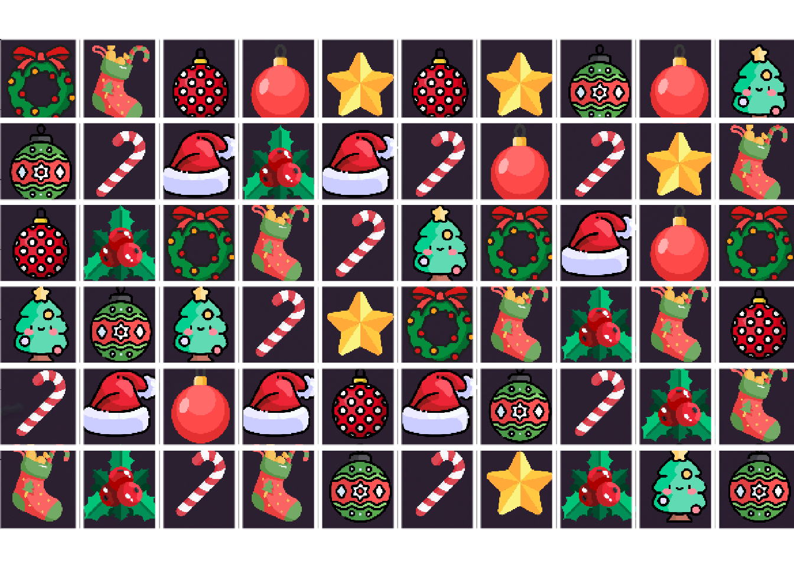

```{r}
#| include: false
library(ggplot2)

knitr::opts_chunk$set(
  dev.args = list(bg = "transparent"),
  fig.height = 4,
  message = FALSE,
  warning = FALSE
)

theme_set(
  theme_minimal(base_size = 16) +
    theme(
      plot.background = element_rect(fill = "transparent", colour = NA),
      panel.background = element_rect(fill = "transparent", colour = NA),
      legend.background = element_rect(fill = "transparent", colour = NA),
      legend.key = element_rect(fill = "transparent", colour = NA),
      text = element_text(colour = "grey90"),
      axis.text = element_text(colour = "grey90"),
      panel.grid = element_line(colour = "grey35")
    )
)

CM <- 2.54
KG <- 0.45359237

personas <- na.omit(modelr::heights[, c("height", "weight", "sex")])
personas <- data.frame(
  height = personas$height * CM,
  weight = personas$weight * KG,
  sex = personas$sex
)
set.seed(42)
personas <- personas[sample(nrow(personas), 300), ]
```

## Agenda de hoy

1.  Revisión de entregas (en vivo)

2.  Clasificar: dos clases

3.  Extensión: diez clases en un tablero de juego

4.  Resumen

# 1. Revisión de entregas

## Los juegos del laboratorio 4

Los cuatro juegos están publicados y se juegan desde el navegador:

<https://dietrichson.github.io/IA-UNSAM-2026/juegos/>

-   **Breakout**, **Ahorcado**, **Memotest**, **Ta-te-ti**.

-   Los miramos en vivo: ¿corre? ¿se entiende? ¿qué le pidieron al modelo?

::: {.fragment}
Queda un PR pendiente de correcciones. Lo vemos también.
:::

# 2. Clasificar: dos clases

## De la regresión a la clasificación

En la presentación 5 usamos estos mismos datos para predecir el **peso** a partir de la **altura**:

``` r
lm(weight ~ height, data = personas)
```

-   La respuesta era un número: 72,4 kg.

::: {.fragment}
Hoy cambiamos la pregunta. La respuesta ya no es un número: es una **categoría**.

¿Esta persona es varón o mujer?
:::

## Los mismos datos, otra pregunta

```{r}
#| echo: true
ggplot(personas, aes(height, weight, colour = sex)) +
  geom_point(alpha = 0.6) +
  labs(x = "Altura (cm)", y = "Peso (kg)", colour = "Sexo")
```

## ¿Y si usamos una recta?

```{r}
#| echo: true
# Codificamos la respuesta como 0/1 y le ajustamos una recta.
personas$es_mujer <- as.integer(personas$sex == "female")
recta <- lm(es_mujer ~ height, data = personas)

ggplot(personas, aes(height, es_mujer)) +
  geom_point(alpha = 0.25, colour = "steelblue") +
  geom_line(aes(y = fitted(recta)), colour = "red", linewidth = 1.2) +
  geom_hline(yintercept = c(0, 1), linetype = "dashed", colour = "grey60") +
  labs(x = "Altura (cm)", y = "¿Es mujer? (0 / 1)")
```

## Lo que predice la recta

```{r}
#| echo: true
predict(recta, newdata = data.frame(height = c(145, 150, 190, 200)))
```

```{r}
#| echo: true
# Cuantas predicciones se van fuera del intervalo [0, 1].
sum(fitted(recta) < 0 | fitted(recta) > 1)
```

::: {.fragment}
La recta no sabe que la respuesta sólo puede valer 0 o 1. De 300 observaciones, 43 caen fuera. Una probabilidad de −0,46 no significa nada.
:::

## La sigmoide

```{r}
#| echo: true
# plogis() es la sigmoide: aplasta cualquier numero dentro de (0, 1).
z <- seq(-8, 8, length.out = 300)

ggplot(data.frame(z, p = plogis(z)), aes(z, p)) +
  geom_line(colour = "red", linewidth = 1.2) +
  geom_hline(yintercept = c(0, 1), linetype = "dashed", colour = "grey60") +
  labs(x = "z = b0 + b1 · altura", y = "p")
```

## La fórmula {.smaller}

$$p = \frac{1}{1 + e^{-(\beta_0 + \beta_1 x)}}$$

| Símbolo | Qué es |
|---|---|
| $x$ | El predictor. Acá, la altura en cm. |
| $\beta_0$, $\beta_1$ | Los dos números que el modelo aprende. |
| $\beta_0 + \beta_1 x$ | Una recta, igual que en la regresión lineal. |
| $e^{-(\cdot)}$ | La exponencial que aplasta esa recta. |
| $p$ | La probabilidad de una de las dos clases. Siempre entre 0 y 1. |

::: {.fragment}
Adentro hay un modelo lineal. Lo único nuevo es la función que lo envuelve.
:::

## El modelo, en una línea {.smaller}

```{r}
#| echo: true
modelo <- glm(sex ~ height, family = binomial, data = personas)
coef(modelo)
```

```{r}
#| echo: true
# R modela la probabilidad del SEGUNDO nivel del factor.
levels(personas$sex)
```

::: {.fragment}
El coeficiente de `height` es **negativo**: cuanta más altura, menos probabilidad de `female`.
:::

## Probabilidades para algunas alturas {.smaller}

```{r}
#| echo: true
alturas <- data.frame(height = c(150, 160, 170, 175, 185))
alturas$p_mujer <- predict(modelo, newdata = alturas, type = "response")
knitr::kable(alturas, digits = 3)
```

::: {.fragment}
En 170 cm el modelo todavía duda: 0,581. En 185 cm ya casi no.
:::

## De probabilidad a decisión

```{r}
#| echo: true
ggplot(personas, aes(height, es_mujer)) +
  geom_point(alpha = 0.25, colour = "steelblue") +
  geom_line(aes(y = fitted(modelo)), colour = "red", linewidth = 1.2) +
  geom_hline(yintercept = 0.5, linetype = "dashed", colour = "orange",
             linewidth = 0.9) +
  labs(x = "Altura (cm)", y = "p(mujer)")
```

Por arriba de 0,5 decimos `female`; por abajo, `male`.

## La matriz de confusión {.smaller}

```{r}
#| echo: true
p <- predict(modelo, type = "response")
predicho <- ifelse(p > 0.5, "female", "male")

table(real = personas$sex, predicho = predicho)
```

```{r}
#| echo: true
mean(predicho == personas$sex)   # exactitud
```

::: {.fragment}
Si llamamos *positivo* a `female`, que es la clase cuya probabilidad modelamos:

-   **Falso positivo**: un varón clasificado como mujer. Acá, 24.

-   **Falso negativo**: una mujer clasificada como varón. Acá, 18.
:::

## Dos predictores

```{r}
#| echo: true
modelo2 <- glm(sex ~ height + weight, family = binomial, data = personas)
coef(modelo2)
```

-   Ahora hay **tres** números: una ordenada y una pendiente por predictor.

::: {.fragment}
Con dos predictores la frontera deja de ser un punto sobre la altura y pasa a ser una **recta** en el plano altura–peso.
:::

## Dónde está la frontera

La frontera es el conjunto de puntos donde el modelo duda, es decir $p = 0{,}5$. Eso pasa cuando el exponente vale cero:

$$\beta_0 + \beta_1 h + \beta_2 w = 0$$

Despejamos el peso:

$$w = -\frac{\beta_0}{\beta_2} - \frac{\beta_1}{\beta_2}\,h$$

```{r}
#| echo: true
b <- coef(modelo2)
c(ordenada = -b[1] / b[3], pendiente = -b[2] / b[3])
```

## La frontera sobre los datos

```{r}
#| echo: true
ggplot(personas, aes(height, weight, colour = sex)) +
  geom_point(alpha = 0.6) +
  geom_abline(intercept = -b[1] / b[3], slope = -b[2] / b[3],
              colour = "white", linewidth = 1.2) +
  labs(x = "Altura (cm)", y = "Peso (kg)", colour = "Sexo")
```

Casi vertical: el peso casi no mueve la frontera.

## ¿Mejoró con el segundo predictor? {.smaller}

```{r}
#| echo: true
exactitud <- function(m) {
  pr <- ifelse(predict(m, type = "response") > 0.5, "female", "male")
  mean(pr == personas$sex)
}

knitr::kable(data.frame(
  modelo     = c("sex ~ height", "sex ~ height + weight"),
  parametros = c(length(coef(modelo)), length(coef(modelo2))),
  exactitud  = c(exactitud(modelo), exactitud(modelo2))
), digits = 3)
```

::: {.fragment}
Agregar el peso **empeora** la exactitud: 258 aciertos contra 257. Un predictor más no es automáticamente un modelo mejor.
:::

## Mover el umbral {.smaller}

```{r}
#| echo: true
umbrales <- do.call(rbind, lapply(c(0.3, 0.5, 0.7), function(u) {
  pr <- ifelse(p > u, "female", "male")
  data.frame(
    umbral          = u,
    exactitud       = mean(pr == personas$sex),
    falsos_positivos = sum(pr == "female" & personas$sex == "male"),
    falsos_negativos = sum(pr == "male"   & personas$sex == "female")
  )
}))
knitr::kable(umbrales, digits = 3, row.names = FALSE)
```

::: {.fragment}
El modelo no cambió: son las mismas 300 probabilidades. Lo único que se movió es dónde cortamos.

El umbral es una **decisión**, no una propiedad del modelo. Cuál conviene depende de cuál de los dos errores duele más.
:::

## Lo que el modelo aprendió

```{r}
#| echo: true
coef(modelo)
```

-   Eso es **todo** el modelo: dos números.

-   Con ellos se reconstruye cualquier predicción, para cualquier altura.

::: {.fragment}
Es la misma idea de la presentación 5, donde la recta eran dos parámetros. Cambió lo que hacemos con ellos, no cuántos hay.
:::

# 3. Diez clases en un tablero de juego

## x-mas-3 {.smaller}

Un proyecto anterior del docente: [`chi2labs/x-mas-3`](https://github.com/chi2labs/x-mas-3), una IA que juega a un *match-3* navideño.

-   El motor de juego sabe resolver un tablero, pero el tablero está **en la pantalla**.

-   No hay acceso al código fuente del juego: sólo capturas de pantalla.

::: {.fragment}
Hay que convertir un PNG en una matriz de 6×10 con el tipo de cada baldosa.
:::

## El cuello de botella

> "The real bottleneck in this workflow is the transition from a graphic format (in this case a png format) to a board matrix which Gatai can evaluate."
>
> --- `quarto/computer-vision-model.qmd`, línea 50

-   Abrir el navegador, sacar la captura y hacer las jugadas ya estaba resuelto.

-   Lo que faltaba era **mirar**.

::: {.fragment}
Eso es un problema de clasificación: cada baldosa es una de diez clases.
:::

## La grilla sobre el tablero



Se recorta el tablero, se calculan los centroides de la grilla (`R/calculate-centroid-coordinates.R`) y queda un rectángulo por baldosa: 6 filas × 10 columnas.

## Recortar una baldosa {.smaller}

`R/screenshot-get-tile.R`, líneas 20–33:

``` r
crop_x <- my_row$x - (tile_width/2)
crop_y <- my_row$y - (tile_height/2)

cropped_img <-
  image_crop(
    board,
    geometry =
      geometry_area(width = tile_width, height = tile_height,
                    x_off = crop_x,
                    y_off = crop_y)
  )
```

Los valores por defecto de la función: `tile_width = 68`, `tile_height = 69`.

## Las diez clases

::: {layout-ncol="5"}


:::

## Dieciocho números por baldosa {.smaller}

`R/color-analysis.R`, líneas 51–74. Por baldosa: media y desvío de R, G y B sobre toda la imagen, más la media de R, G y B en cada uno de cuatro sectores.

``` r
data.frame(
  R   = mean(tmp[1,]),
  G   = mean(tmp[2,]),
  B   = mean(tmp[3,]),
  R_S   = sd(tmp[1,]),
  G_S   = sd(tmp[2,]),
  B_S   = sd(tmp[3,]),
  Q1R = mean(tmp[1,q1]),
  Q1G = mean(tmp[2,q1]),
  Q1B = mean(tmp[3,q1]),
  # ... Q2 y Q3 igual ...
  Q4R = mean(tmp[1,q4]),
  Q4G = mean(tmp[2,q4]),
  Q4B = mean(tmp[3,q4])
)
```

## Una persona eligió los rasgos {.smaller}

Una baldosa de 68×69 píxeles en color son $68 \times 69 \times 3 = 14.076$ números.

```{r}
#| echo: true
68 * 69 * 3
```

::: {.fragment}
Después del análisis de color quedan **18**.
:::

::: {.fragment}
Nadie aprendió esa reducción: la escribió una persona que miró las baldosas y decidió que el color promedio y cuatro sectores alcanzaban para distinguirlas. Es la misma decisión que en la presentación 8 separaba un agente que aprende de uno que no.
:::

## De dos clases a diez {.smaller}

Con dos clases alcanzaba **una** sigmoide. Con diez clases el modelo calcula **un puntaje por clase** y después los normaliza:

$$p_k = \frac{e^{z_k}}{\sum_j e^{z_j}}$$

| Símbolo | Qué es |
|---|---|
| $k$ | Una de las diez clases. |
| $z_k$ | El puntaje de esa clase: otra vez $\beta_0 + \beta_1 x_1 + \dots$ |
| $e^{z_k}$ | Lo vuelve positivo. |
| $\sum_j e^{z_j}$ | Divide por el total, así los diez suman 1. |
| $p_k$ | La probabilidad de la clase $k$. |

::: {.fragment}
Se queda con la más alta. Es la misma idea de coeficientes, diez veces.
:::

## El modelo, en una línea

`quarto/multinomial-logistic-regression.qmd`, línea 24:

``` r
GataiVision <- nnet::multinom(class ~ ., data = my_data |> select(-image, -time))
```

> "given the very restricted space, and the presumably very small within-class differences \[...\] we decided that *multinomial logistic regression* would be the correct choice."

El `~ .` son los 18 rasgos de color. La variable `class` son las diez clases.

## Los datos de entrenamiento {.smaller}

254 baldosas etiquetadas a mano, en `inst/training-data/`:

| Clase | Baldosas | Clase | Baldosas |
|---|---:|---|---:|
| candy | 37 | stocking | 26 |
| striped | 31 | tree | 25 |
| wreath | 30 | star | 23 |
| berries | 28 | hat | 21 |
| red | 18 | spotted | 15 |

::: {.fragment}
Diez clases, 254 ejemplos. La clase más chica tiene 15.
:::

## Lo que el modelo aprendió, otra vez {.smaller}

El modelo guardado es `inst/vision-model.rds`: **33 KB**.

-   Diez clases, una de referencia, quedan **9** filas de coeficientes.

-   Cada fila tiene una ordenada más los 18 rasgos: **19** números.

-   $9 \times 19 = 171$ números. Eso es el modelo entero.

::: {.fragment}
Dos números clasificaban personas por altura. Ciento setenta y uno clasifican baldosas en diez clases. En el medio no cambió el tipo de modelo: cambió cuántas veces se repite.
:::

## El resultado, y su reparo {.smaller}

> "In total we ran 526 unseen tiles through the model with perfect precision."

526 baldosas que el modelo nunca había visto, todas bien clasificadas. El control fue **visual**: se agruparon por clase predicha y se buscó la que desentonaba.

::: {.fragment}
> "given the paucity of traning data \[...\] I chose to use all the classified data"
:::

::: {.fragment}
No hubo partición de entrenamiento y prueba. Eso **no es una evaluación formal**: 526 aciertos revisados a ojo son un indicio fuerte, no una medida. Nadie reportó una exactitud sobre un conjunto reservado, porque no se reservó ninguno.
:::

## Lo que no funcionó, y se declaró {.smaller}

-   **Comparar byte por byte** contra baldosas de referencia. Falló: *"there exist minute differences between like tiles, probably due to imprecisions introduces when cropping"*.

-   **Una red en Keras sobre los píxeles crudos**, escalados a 72×72×3. El intento está en `docs/image-classification-model-training.qmd`, con las capas convolucionales comentadas. No reporta ningún resultado ni deja un modelo guardado.

-   **Un error encontrado después de entrenar**: *"Instead of dividing the image into quadrants which was my intention, they were divided into quarters from the top."* Los "cuadrantes" eran franjas horizontales. Se dejó así, porque el modelo ya funcionaba.

::: {.fragment}
Las tres están escritas en el repositorio, no en una nota al pie. Un rasgo que resultó ser otra cosa y aun así funcionó es un dato sobre el problema, y hay que poder encontrarlo.
:::

# 4. Resumen

## Clasificar, en cinco líneas

-   **Clasificar** es predecir una categoría en vez de un número.

-   La **regresión logística** es un modelo lineal pasado por una sigmoide: adentro hay una recta.

-   El **umbral** es una decisión nuestra, no una propiedad del modelo. Moverlo cambia qué error cometemos.

-   Con más clases es la misma idea: un puntaje por clase y **softmax** elige el mayor.

-   Un predictor más no es automáticamente un modelo mejor.

## Dos lecciones del tablero

-   **Los rasgos elegidos por una persona pueden ganarle a los píxeles crudos** cuando el problema es chico. 18 números bien elegidos, 254 ejemplos, 171 coeficientes, 33 KB.

-   **Hay que evaluar sobre datos que el modelo no vio.** 526 aciertos revisados a ojo no son una exactitud sobre un conjunto reservado, y conviene decirlo así.

::: {.fragment}
Las dos lecciones tiran para lados distintos. La primera dice que pensar el problema rinde; la segunda, que pensarlo no alcanza para saber si funcionó.
:::

## Lo que viene

-   Cuando los rasgos no se pueden elegir a mano, hay que **aprenderlos**. Eso es lo que hace una red convolucional con los píxeles crudos.

-   Y hace falta mucha más data que 254 ejemplos.

-   La pregunta abierta: ¿cómo se mide un clasificador cuando etiquetar un ejemplo cuesta tiempo de una persona?
